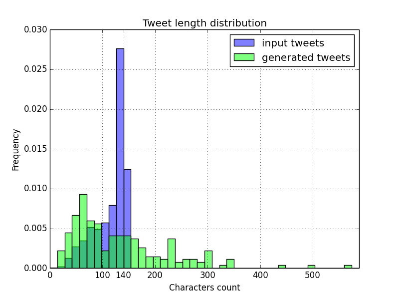

# make-lstm-great-again
This project aims to artificially recreate Donald Trump's very unique and peculiar tweeting style.
It uses the Twitter API to fetch the aforementioned tweets, and a LSTM recurrent neural network to generate new content matching the style of this dataset.

## Twitter Scraper
Fetch the tweets from a given twitter handle.

## Installation

```
pip install -r requirements.txt
```

### Usage

```
Usage:
  twitter_scraper.py <handle> [-o <file>] [-c <n>]
                              [--include_retweets]
                              [--delay <seconds>]
                              [--token <t>]
                              [--encoding <e>]
  twitter_scraper.py -h | --help

Options:
  -h --help
  -o <file> --output <file>  Output file [default: tweets.txt]
  -c <n> --count <n>         Number of tweets fetched [default: 500]
  --include_retweets         Include retweets in the result
  --delay <seconds>          Delay between two API calls [default: 30]
  --token <t>                Token appended at the end of each tweet [default: \EOT]
  --encoding <e>             Encoding used when saving the tweets [default: utf-8]
```

### Configuration
The Twitter API authentification step has to be configured via a `config.json` file
holding the following dictionary:
```
{
    "consumer_key":"<consumer_key>",
    "consumer_secret":"<consumer_secret>",
    "access_token":"<access_token>",
    "access_token_secret":"<access_token_secret>"
}
```
### Example

```bash
# Quickly fetch most of Donald Trump's tweets
$ python twitter_scraper.py realDonaldTrump -c 34000 --delay 2
```

## LSTM
Automatic generation of text similar to a given input document.

### Usage

```
Usage:
  lstm.py train [-i <file>] [--maxlen <l>]
                [--checkpoint_path <p>] [--no_autoload]
  lstm.py generate [-o <file>]
                   [-c <n>] [--maxlen <l>] [--temperature <T>]
  lstm.py -h | --help

Options:
  -h --help
  -i <file> --input <file>   Input text file [default: input.txt]
  -o <file> --output <file>  Output generated file [default: output.txt]
  -c <n> --count <n>         Number of characters generated [default: 1000]
  --maxlen <l>               Maximum length of sequences [default: 20]
  --temperature <T>          Novelty in the generation, usually between 0. and 2.
                             If not provided, output will be generated with
                             several temperatures [default: 1.0]
  --checkpoint_path <p>      Name of the model snapshots that will be saved at
                             each checkpoint. [default: model-save]
  --no_autoload              Do not load the last saved checkpoint model even
                             if it exists
```

### Example

```bash
# Train a LSTM on previously fetched tweets
$ python lstm.py train -i tweets.txt
```

```bash
# Generate about 100 brand new Donald Trump's tweets from trained model
$ python lstm.py generate -i tweets.txt -c 14000
```

## Results

28000 characters have been generated in `output.txt` (about 200 tweets) after a few hours of learning.

Here are some observation on the produced data.

### Length

A tweet should never be more than 140 characters. On the generated dataset, we can see that this constraint is often violated, with about half of the tweets between 140 and 300 characters.



### Exclamation points!

I noticed that a lot of @realDonaldTrump's tweets contain or even end with an exclamation point.
Let's take a look at the generated data.

```
1947 exclamation points out of 3230 tweets (60%) in input data
542 exclamation points out of 834 tweets (65%) in generated data

976 exclamation points ending the tweet out of 3230 tweets (30%) in input data
263 exclamation points ending the tweet out of 834 tweets (32%) in generated data
```
The overall proportions seem to be respected.

### MY COMPUTER IS STUCK ON CAPS LOCK, WHAT DO I DO?

Likewise, a lot of tweets contain at least one uppercase word. The frequency is again respected in the generated dataset. Most common uppercase words also match.

```
1123 tweets containing an uppercase word out of 3230 tweets (35%) in input data
278 tweets containing an uppercase word out of 834 tweets (33%) in generated data

25 most common uppercase words in input dataset:
AMERICA: 117
GREAT: 107
MAKE: 104
CNN: 101
MAGA: 97
AGAIN: 95
ISIS: 44
VOTE: 38
MOVEMENT: 37
THE: 32
YOU: 31
GOP: 28
TRUMP: 27
AND: 27
SAFE: 27
THANK: 26
ICYMI: 25
FBI: 25
POTUS: 20
FAKE: 17
NEWS: 17
CLINTON: 14
WIN: 14
JOBS: 13
DNC: 13


25 most common uppercase words in generated dataset:
GREAT: 47
AGAIN: 47
AMERICA: 46
MAGA: 45
MAKE: 45
CNN: 29
VOTE: 18
THE: 8
DNC: 7
MOVEMENT: 7
GOP: 7
AND: 6
ISIS: 6
FBI: 5
PAD: 3
SAD: 3
REAT: 3
AMERICANS: 3
PEOPLE: 2
VETE: 2
SAFE: 2
PATHE: 2
WILL: 2
THANK: 2
THANG: 2
```